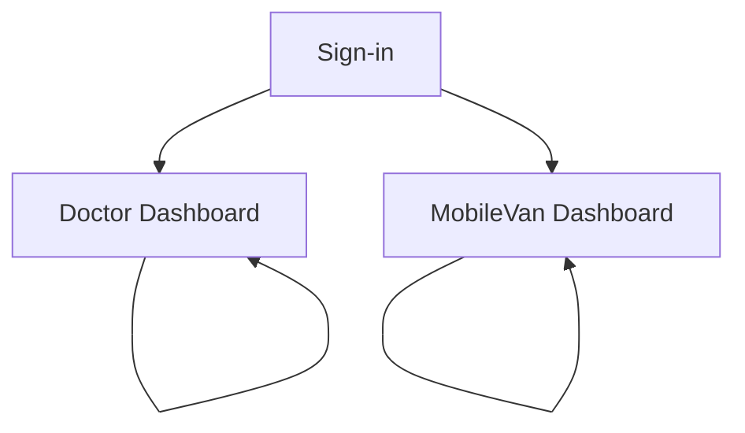

## 1. Product Overview
Add Mapbox GL JS maps to the Doctor and MobileVan dashboards to visualize current positions and routes.
Consume existing backend navigation/location APIs and a WebSocket feed to keep map state live and reliable.

## 2. Core Features

### 2.1 User Roles
| Role | Registration Method | Core Permissions |
|------|---------------------|------------------|
| Doctor | Existing organization login (SSO/email/password as already supported) | View live MobileVan locations and routes; inspect route details (ETA, steps); follow a van; monitor connection freshness |
| MobileVan Operator | Existing organization login (SSO/email/password as already supported) | View own van location; view assigned route; start/stop navigation session; confirm connectivity status |

### 2.2 Feature Module
Our requirements consist of the following main pages:
1. **Sign-in**: authenticate access to dashboards; handle session expired.
2. **Doctor Dashboard**: live map with vans; route visualization; list + details panel; filters.
3. **MobileVan Dashboard**: live map centered on own van; assigned route view; navigation status + connectivity.

### 2.3 Page Details
| Page Name | Module Name | Feature description |
|-----------|-------------|---------------------|
| Sign-in | Authentication | Sign in with existing method; redirect to the correct dashboard; show error states (invalid credentials, locked account, network error). |
| Doctor Dashboard | Map (Mapbox) | Render interactive map; display van markers; cluster/declutter markers at wider zoom; show selected van highlight. |
| Doctor Dashboard | Route visualization | Draw route polyline from backend navigation API; show start/end pins; show ETA/distance summary. |
| Doctor Dashboard | Live updates | Subscribe to WebSocket for location updates; smoothly update markers; indicate data freshness (e.g., “updated 5s ago”). |
| Doctor Dashboard | Van list + selection | List vans with status; search/filter (by van name/id + online/offline); select a van to focus map and open details. |
| Doctor Dashboard | Details drawer | Show selected van details: last known coordinates/time, speed/heading (if provided), route summary, and connection status. |
| MobileVan Dashboard | Map (Mapbox) | Render interactive map centered on the van; show current position with heading indicator; provide recenter control. |
| MobileVan Dashboard | Assigned route | Fetch current/next route from backend; draw route polyline; show next step instruction if provided. |
| MobileVan Dashboard | Live telemetry | Receive live location/route updates over WebSocket; show connectivity banner; handle reconnect/backoff. |
| MobileVan Dashboard | Navigation session status | Show “On route / Paused / Completed”; allow start/stop session actions if supported by backend. |

## 3. Core Process
**Doctor Flow**
1. Sign in and land on Doctor Dashboard.
2. Map loads initial van locations and renders markers.
3. Select a van from list or map to focus view and open details.
4. Dashboard requests route data for the selected van and draws route on the map.
5. As WebSocket updates arrive, the marker and freshness indicators update in real time.

**MobileVan Operator Flow**
1. Sign in and land on MobileVan Dashboard.
2. Map centers on own van location; assigned route loads and draws.
3. Operator monitors live position and route progress; the page keeps updating via WebSocket.
4. If connection drops, the UI shows degraded state and retries until recovered.

