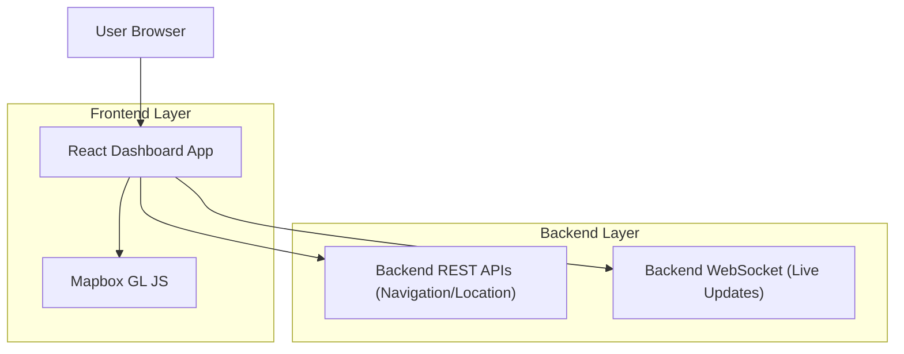

## 1.Architecture design


## 2.Technology Description
- Frontend: React@18 + Mapbox GL JS + TypeScript
- Backend: Existing backend (REST for navigation/location + WebSocket for streaming updates)

## 3.Route definitions
| Route | Purpose |
|-------|---------|
| /login | Authenticate and establish session for dashboard access |
| /doctor | Doctor Dashboard: multi-van live map + route inspection |
| /mobilevan | MobileVan Dashboard: own-van live map + assigned route |

## 4.API definitions (If it includes backend services)
### 4.1 Core API (contracts the frontend consumes)
Note: Align paths/field names to your existing backend; below defines the minimum contract needed.

**Get current locations (initial load / polling fallback)**
```
GET /api/locations/vans
GET /api/locations/vans/{vanId}
```

**Get route (polyline + summary)**
```
GET /api/navigation/routes/current?vanId={vanId}
```

**(Optional) Update navigation session status (if supported today)**
```
POST /api/navigation/sessions/{sessionId}/status
```

### 4.2 WebSocket
```
WS /ws
```
Client subscribes (example):
```json
{ "type": "subscribe", "topics": ["van.location", "van.route"] }
```

Server pushes (examples):
- `van.location`: high-frequency location updates for one or more vans
- `van.route`: route changed/updated (e.g., re-route)

### 4.3 Shared TypeScript types
```ts
export type ISO8601 = string;

export type LatLng = { lat: number; lng: number };

export type VanLocation = {
  vanId: string;
  position: LatLng;
  headingDeg?: number;
  speedMps?: number;
  capturedAt: ISO8601; // timestamp from device/server
};

export type RouteSummary = {
  distanceMeters?: number;
  durationSeconds?: number;
  etaAt?: ISO8601;
};

export type NavigationRoute = {
  vanId: string;
  polylineGeoJson: GeoJSON.Feature<GeoJSON.LineString>;
  summary?: RouteSummary;
  updatedAt: ISO8601;
};

export type WsMessage =
  | { type: "van.location"; payload: VanLocation | VanLocation[] }
  | { type: "van.route"; payload: NavigationRoute };
```

## 6.Data model(if applicable)
No new database entities are required for the map integration (the dashboards consume existing navigation/location data).
